- title : EvoDistroLisa - EvoLisa reborn
- description : EvoDistroLisa - EvoLisa reborn
- author : Milosz Krajewski
- theme : beige
- transition : default

***

# EvoDistroLisa

### EvoLisa resurected by Agents

 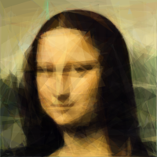 

---

youtube: http://goo.gl/g6hnnm

blog: http://goo.gl/UY48nn

github: https://goo.gl/9kBDiI

***

### About me

- Milosz Krajewski
- @MrKrashan
- BLOBAs @ Sepura
- first line of code written in ~1984
- C, C++, C#, SQL, Java
- (Iron)Python, F#, Scala

---

### Background

- Algorithms
- Data Structures
- Algorithm Complexity
- Graph Theory
- Design Patterns

---

### Most recently

- Parallel
- Distributed
- Reactive
- Functional

***

### Disclaimer

As a learning project started long time ago, the code is not what I would write today. I tried to polish it a little bit for this presentation, but I'm still not happy...

The code presented is usually a little bit idealized with "implementation induced ugliness" removed, and it is not working code but just close approximation of it.

***

# Domain

---

### Point

    [lang=fs]
    type Point = { X: double; Y: double }

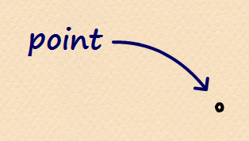

---

### Brush

	[lang=fs]
    type Brush = { A: double; R: double; G: double; B: double }

---

### Polygon

    [lang=fs]
    type Polygon = { Brush: Brush; Points: Point array }

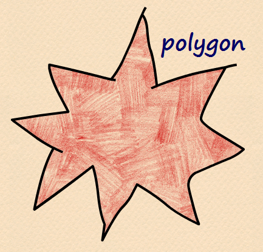

---

### Pixels

    [lang=fs]
    type Pixels = { Width: int; Height: int; Pixels: uint32 array }

`uint32 array` is used for performance reasons and should store pixels in PARGB32 format.

---

### Scene & RenderedScene

    [lang=fs]
    type Scene = Polygon array
    type RenderedScene = { Scene: Scene; Fitness: double }

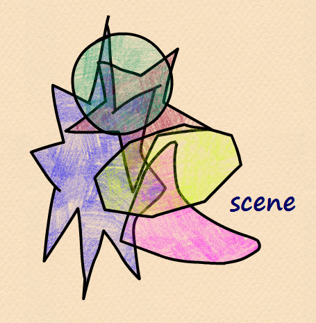

***

# Spin!

---

### Mutate, Render, Fit

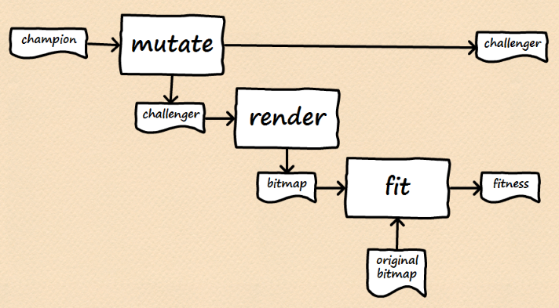

---

### Select

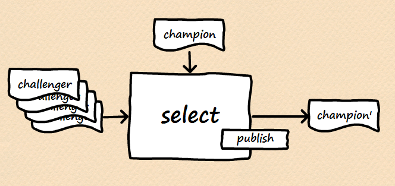

---

### Select

    [lang=fs]
    // type Publisher = RenderedScene -> unit
    // type RenderedScene = { Scene: Scene; Fitness: double }

    let inline fitnessOf (scene: RenderedScene) = scene.Fitness

    let select publish champion challengers =
        let challenger = challengers |> Seq.maxBy fitnessOf
        match fitnessOf challenger > fitnessOf champion with
        | true -> challenger |> publish; challenger
        | _ -> champion

---

### Improve

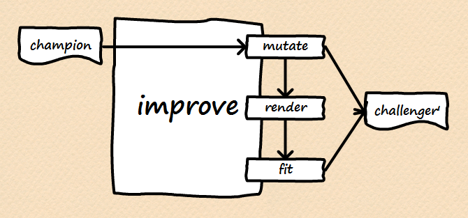

---

### Improve

    [lang=fs]
    // type Mutator = Scene -> Scene
    // type Renderer = Scene -> 'Pixels
    // type Fitter = 'Pixels -> double
    // type RenderedScene = { Scene: Scene; Fitness: double }

    let inline sceneOf (scene: RenderedScene) = scene.Scene

    let improve mutate render fit champion =
        let challenger = champion |> sceneOf |> mutate
        let fitness = challenger |> render |> fit
        { Scene = challenger; Fitness = fitness }

---

### Passive loop

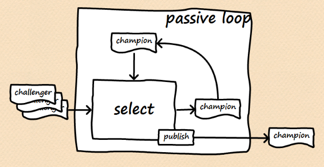

---

### Passive loop

    [lang=fs]
    let rec passiveLoop publish champion inbox = async {
        let! challengers = inbox |> Agent.recvMany
        let champion' = challengers |> select publish champion
        do! passiveLoop publish champion' inbox
    }

**Note**: "others" are the only source of candidates

---

### Active loop

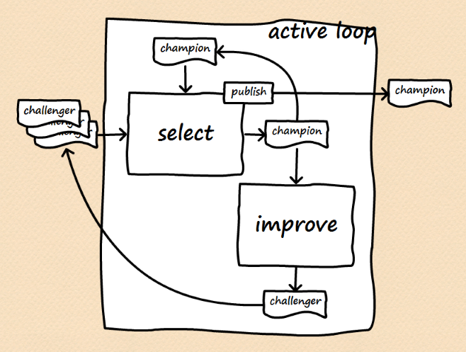

---

### Active loop

    [lang=fs]
    let rec activeLoop mutate render fit publish champion inbox = async {
        let! challengers = inbox |> Agent.recvMany
        let champion' = challengers |> select publish champion
        let challenger' = champion |> improve mutate render fit
        inbox |> Agent.send challenger'
        do! activeLoop mutate render fit publish champion' inbox
    }

---

    [lang=fs]
    // let rec passiveLoop publish champion inbox = async { ... }
    // let rec activeLoop mutate render fit publish champion inbox = async { ... }

    typeof(passiveLoop) == typeof(activeLoop mutate render fit)

**Note**: passive and active loop implement the same "interface"

***

# Mutate!

---

### Scene

    [lang=fs]
    // type RNG = unit -> double

    let mutateScene rng scene =
        scene
        |> removePolygon rng
        |> insertPolygon rng
        |> shufflePolygons rng
        |> Array.map (mutatePolygon rng)

---

### Polygon

    [lang=fs]
    let mutatePolygon rng polygon =
        { polygon with
            Brush = mutateBrush rng polygon.Brush
            Points = mutatePoints rng polygon.Points }

    let mutateBrush rng brush =
        { brush with
            A = mutateValue rng brush.A
            R = mutateValue rng brush.R
            G = mutateValue rng brush.G
            B = mutateValue rng brush.B }

    let mutatePoints rng points =
        points
        |> removePoint rng
        |> insertPoint rng
        |> shufflePoints rng
        |> Array.map (mutatePoint rng)

---

### Point

    [lang=fs]
    let mutatePoint rng point =
        { point with
            X = mutateValue rng point.X
            Y = mutateValue rng point.Y }

***

# Agent

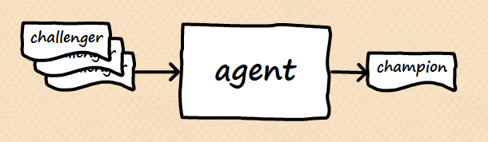

---

### Agent

    [lang=fs]
    [<Interface>]
    type IAgent = 
        abstract member Push: RenderedScene -> unit
        abstract member Improved: IObservable<RenderedScene>

---

### Wrapping loops as agents
    
    [lang=fs]
    // let rec passiveLoop publish champion inbox = async { ... }

    let createAgent loop champion =
        let improved = Event<RenderedScene>()
        let publish scene = scene |> improved.Trigger
        let agent = Agent.start (loop publish champion)
        { new IAgent with 
            member x.Push(scene: RenderedScene) = 
                agent |> Agent.send scene
            member x.Improved = 
                improved.Publish :> IObservable<_> 
        }

    let createPassiveAgent champion = 
        champion |> createAgent passiveLoop

    let createActiveAgent mutate render fit champion = 
        champion |> createAgent (activeLoop mutate render fit)

---

### Attach agent

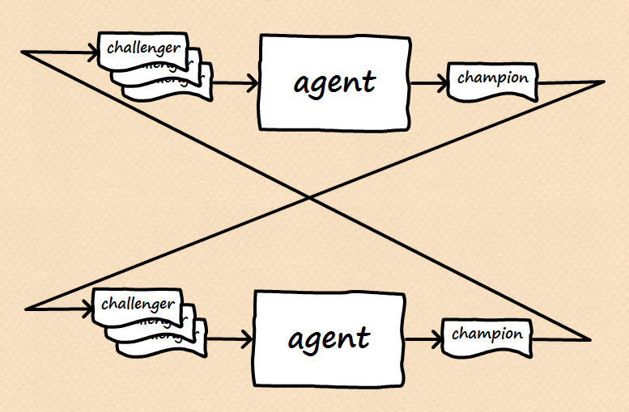

---

### Attach agent

    [lang=fs]
    let attachAgent (slave: IAgent) (master: IAgent) =
        master.Improved |> Observable.subscribe slave.Push |> ignore
        slave.Improved |> Observable.subscribe master.Push |> ignore

---

### Composite agent

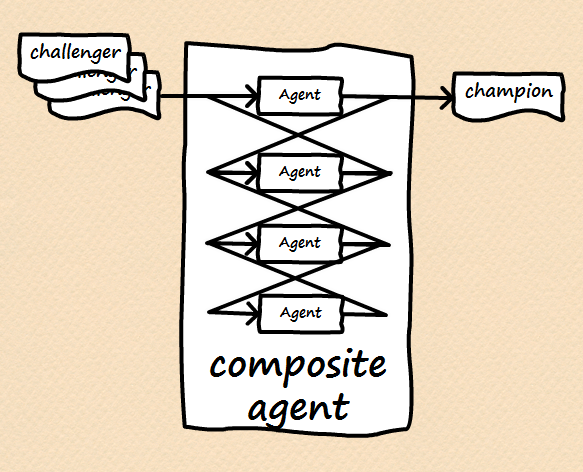

---

### Composite agent

    [lang=fs]
    let createCompositeAgent count mutate render fit champion = 
        let master = createActiveAgent mutate render fit champion
        { 2..count } |> Seq.iter (fun _ ->
            let slave = createActiveAgent mutate render fit champion
            master |> attachAgent slave
        )
        master

***

### Socket agent

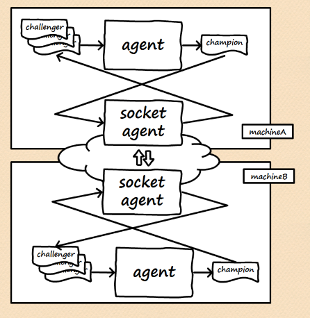

---

### Socket agent

    [lang=fs]
    let encode message = message |> Pickler.save
    let decode<'a> bytes = bytes |> Pickler.load<'a>

    let createSocketAgent subSocket pubSocket champion =
        let send scene = pubSocket |> Socket.send (scene |> encode)
        let received = subSocket |> Socket.observe |> Observable.map decode
        let agent = createPassiveAgent champion
        received |> Observable.subscribe agent.Push
        agent.Improved |> Observable.subscribe send
        agent

***

# Demo

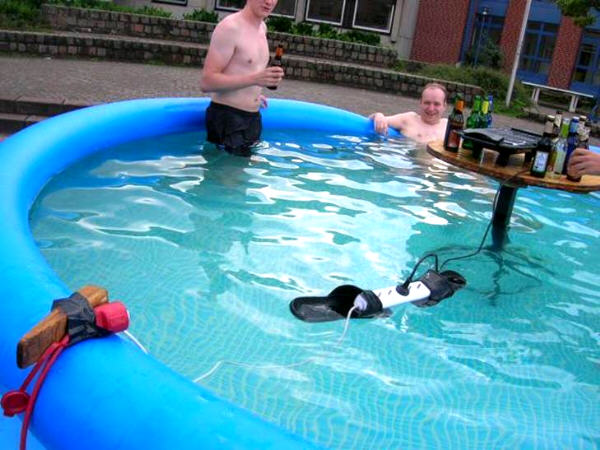

---

### Download

https://goo.gl/VXjcal

or

https://github.com/MiloszKrajewski/EvoDistroLisa

---

### Server

    [lang=bash]
    evo.exe --listen 5801 --suave 5802 --agents 4 --gui --restart monalisa.png

---

### Client

    [lang=bash]
    evo.exe --agents 4 --gui --connect <ip> 5801

***

### Conclussion

- Random is not thread safe
- GDI+ is much faster than WPF (to draw polygons)
- GDI+ has internal locks so only one threads may use it
- WPF uses anti-aliasing
- Anti-aliasing in WPF cannot be turned off
- WritableBitmapEx does not use anti-aliasing
- WritableBitmapEx is more portable but slower than WPF
- All ZeroMQ operations on socket need to be in the same thread

---

### Excuses

This project provided me with excuses to use:

- Suave.IO
- FsPickler
- ArgU
- ZeroMQ
- Rx
- xUnit
- FAKE
- Paket

---

### Excuses for the future

- Elm / TypeScript client
- HTML5 Canvas
- WebSockets / SignalR
- Windows Phone / Android app
- Running agents on Azure

***

### Questions?

***

### Turn back!

***

### Don't go there!

***

### Told you!
