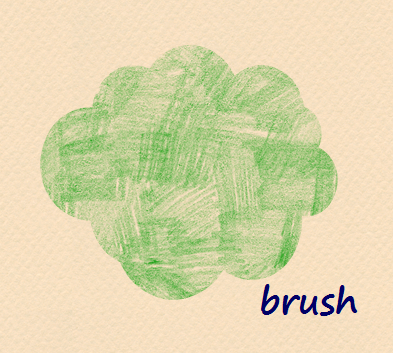
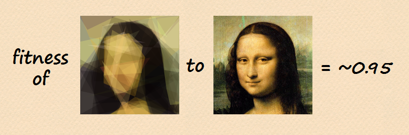
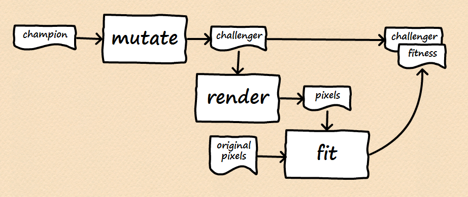
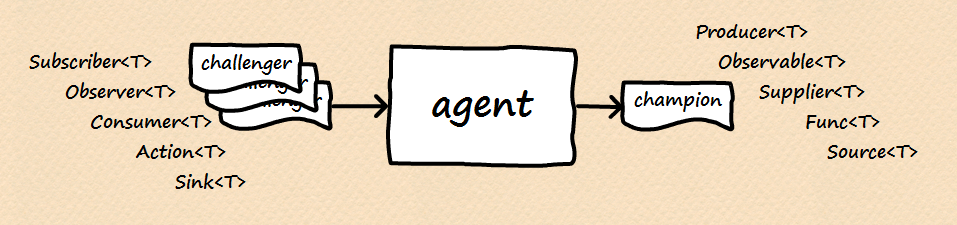
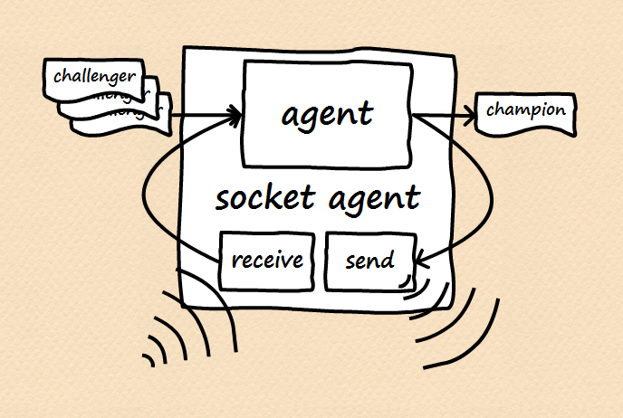

- title : EvoDistroLisa - EvoLisa reborn
- description : EvoDistroLisa - EvoLisa reborn
- author : Milosz Krajewski
- theme : beige
- transition : default

***

# EvoDistroLisa

### actor based cooperative hill climbing

  

---

youtube: http://goo.gl/g6hnnm

blog: http://goo.gl/UY48nn

github: https://goo.gl/9kBDiI

***

### About me

- Milosz Krajewski
- @MrKrashan
- BLOBAs @ Sepura
- first line of code written in ~1984
- C, C++, C#, SQL, Java
- (Iron)Python, F#, Scala

---

### Background

- Algorithms
- Data Structures
- Algorithm Complexity
- Graph Theory
- Design Patterns

---

### Most recently

- Parallel
- Distributed
- Reactive
- Functional

***

### Disclaimer

As a learning project started long time ago, the code is not what I would write today. I tried to polish it a little bit for this presentation, but I'm still not happy...

The code presented is usually a little bit idealized with "implementation induced ugliness" removed, and it is not working code but just close approximation of it.

***

# Domain

---

### Point

```fsharp
type Point = { X: double; Y: double }
```


---

### Brush

```fsharp
type Brush = { A: double; R: double; G: double; B: double }
```



---

### Polygon

```fsharp
type Polygon = { Brush: Brush; Points: Point array }
```


---

### Pixels

```fsharp
type Pixels = { Width: int; Height: int; Pixels: uint32 array }
```

`uint32 array` is used for performance reasons and stores pixels in PARGB32 format.

---

### Scene & RenderedScene

```fsharp
type Scene = Polygon array
type RenderedScene = { Scene: Scene; Fitness: double }
```


***

# Mutate

```fsharp
type Mutator = Scene -> Scene
```

***

# Render

```fsharp
type Renderer = Scene -> 'Pixels
```

***

# Fit

```fsharp
type Fitter = 'Pixels -> double
```

---



***

### Mutate, Render, Fit



***

# Spin!

---

### Select


---

### Select

```fsharp
// type Publisher = RenderedScene -> unit
// type RenderedScene = { Scene: Scene; Fitness: double }

let inline fitnessOf (scene: RenderedScene) = scene.Fitness

let select publish champion challengers =
    let challenger = challengers |> Seq.maxBy fitnessOf
    match fitnessOf challenger > fitnessOf champion with
    | true -> challenger |> publish; challenger
    | _ -> champion
```

---

### Passive loop


---

### Passive loop

```fsharp
let rec passiveLoop publish champion inbox = async {
    let! challengers = inbox |> Agent.recvMany
    let champion' = challengers |> select publish champion
    do! passiveLoop publish champion' inbox
}
```

**Note**: "others" are the only source of candidates

---

### Improve


---

### Improve

```fsharp
// type Mutator = Scene -> Scene
// type Renderer = Scene -> 'Pixels
// type Fitter = 'Pixels -> double
// type RenderedScene = { Scene: Scene; Fitness: double }

let inline sceneOf (scene: RenderedScene) = scene.Scene

let improve mutate render fit champion =
    let challenger = champion |> sceneOf |> mutate
    let fitness = challenger |> render |> fit
    { Scene = challenger; Fitness = fitness }
```

---

### Active loop


---

### Active loop

```fsharp
let rec activeLoop mutate render fit publish champion inbox = async {
    let! challengers = inbox |> Agent.recvMany
    let champion' = challengers |> select publish champion
    let challenger' = champion |> improve mutate render fit
    inbox |> Agent.send challenger'
    do! activeLoop mutate render fit publish champion' inbox
}
```

---

```fsharp
// let passiveLoop publish champion inbox = ...
// let activeLoop mutate render fit publish champion inbox = ...

typeof(passiveLoop) == typeof(activeLoop mutate render fit)
```

**Note**: passive and active loop implement the same "interface"

***

# Agent



---

### Agent

```fsharp
[<Interface>]
type IAgent =
    abstract member Push: RenderedScene -> unit
    abstract member Improved: IObservable<RenderedScene>
```

---

### Wrapping loops as agents

```fsharp
// let rec passiveLoop publish champion inbox = async { ... }

let createAgent loop champion =
    let improved = Event<RenderedScene>()
    let publish scene = scene |> improved.Trigger
    let agent = Agent.start (loop publish champion)
    { new IAgent with
        member x.Push(scene: RenderedScene) = agent |> Agent.send scene
        member x.Improved = improved.Publish :> IObservable<_>
    }

let createPassiveAgent champion =
    champion |> createAgent passiveLoop

let createActiveAgent mutate render fit champion =
    champion |> createAgent (activeLoop mutate render fit)
```

---

### Attach agent


---

### Attach agent

```fsharp
let attachAgent (slave: IAgent) (master: IAgent) =
    master.Improved |> Observable.subscribe slave.Push |> ignore
    slave.Improved |> Observable.subscribe master.Push |> ignore
```

---

### Composite agent


---

### Composite agent

```fsharp
let createCompositeAgent count mutate render fit champion =
    let master = createActiveAgent mutate render fit champion
    { 2..count } |> Seq.iter (fun _ ->
        let slave = createActiveAgent mutate render fit champion
        master |> attachAgent slave
    )
    master
```

***

### Socket agent



---

### Socket agent

```fsharp
let encode message = message |> Pickler.save
let decode<'a> bytes = bytes |> Pickler.load<'a>

let createSocketAgent subSocket pubSocket champion =
    let send scene = pubSocket |> Socket.send (scene |> encode)
    let received = subSocket |> Socket.observe |> Observable.map decode
    let agent = createPassiveAgent champion
    received |> Observable.subscribe agent.Push
    agent.Improved |> Observable.subscribe send
    agent
```

***

# Demo


---

### Download

https://github.com/MiloszKrajewski/EvoDistroLisa

(go to releases)

---

### Server

```shell
evo.exe --listen 5801 --suave 5802 --agents 4 --gui --restart monalisa.png
```

---

### Client

```shell
evo.exe --agents 4 --gui --connect <ip> 5801
```

***

### Conclussion

- Random is not thread safe
- GDI+ is much faster than WPF (to draw polygons)
- GDI+ has internal locks so only one threads may use it
- WPF uses anti-aliasing
- Anti-aliasing in WPF cannot be turned off
- WritableBitmapEx does not use anti-aliasing
- WritableBitmapEx is more portable but slower than WPF
- All ZeroMQ operations on socket need to be in the same thread

---

### Excuses

This project provided me with excuses to use:

- Suave.IO
- FsPickler
- ArgU
- ZeroMQ
- Rx
- xUnit
- FAKE
- Paket

---

### Excuses for the future

- Elm / TypeScript client
- Akka.NET with Akka.Persistence
- HTML5 Canvas
- WebSockets / SignalR
- Windows Phone / Android app
- Running agents on Azure

***

### Questions?

***

### Turn back!

***

### Don't go there!

***

### Told you!
